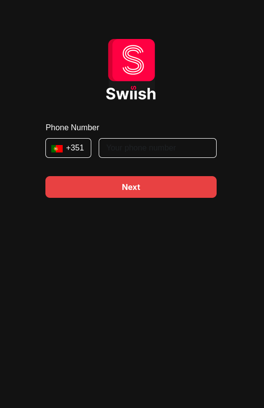
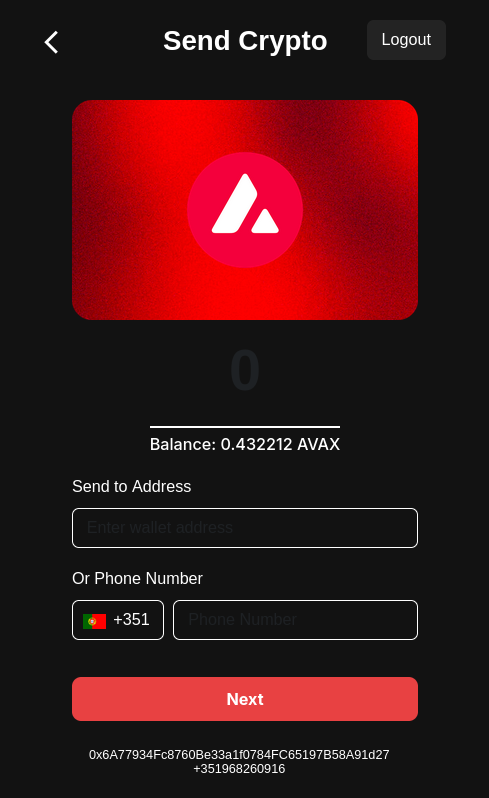
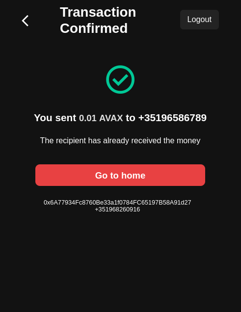

# Swiish Cash

Mobile payment solution that combines the simplicity of phone-based transfers with the power of blockchain technology on the Avalanche network.

## 💡 Breaking Down Crypto Barriers

Swiish Cash aims to make cryptocurrency accessible to everyone by removing traditional barriers to entry. We believe blockchain technology should be as easy to use as traditional payment apps. Here's how we're achieving this:

- **No Crypto Knowledge Required**: Users only need their phone number to send and receive crypto - no need to understand wallet addresses or private keys
- **Familiar Interface**: If you've used mobile payment apps before, you already know how to use Swiish Cash
- **Instant Setup**: Automatic wallet creation means users can start transacting within seconds
- **Simple User Experience**: Send crypto as easily as sending a text message
- **Zero Technical Barriers**: No need to understand blockchain terminology or complicated setup processes

## 🚀 Overview

CryptoMBWay is a web application that allows users to send AVAX (Avalanche's native cryptocurrency) to anyone using just their phone number, similar to traditional mobile payment apps but powered by blockchain technology.

https://app.swiish.cash

## ✨ Features

- Phone number-based authentication
- Send AVAX using phone numbers or wallet addresses
- Real-time gas fee estimation
- Automatic wallet creation for new users
- Mobile-first responsive design

## Screenshots

- HomePage

- Account page

- Confirm Transfer

- Transfer validation

## Notes
- Project is running on the fuji test network https://api.avax-test.network/ext/bc/C/rpc
- The OTP is the only thing is not properly working, for dev purposes the OTP is always the first 4 numbers of a phone number (including the country code numbers). Example:
    - +351968200000: OTP 3519
    - +110008760: OTP 1100